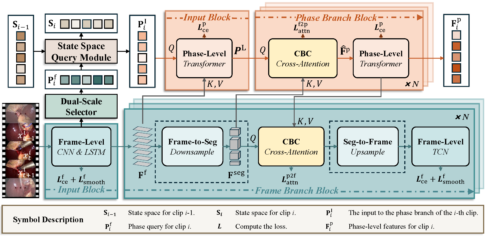

# B2Q-Net 🚀

This repository contains the code for **B2Q-Net**: Bidirectional Branch Query Network for **Online Surgical Phase Recognition**. This repository provides the implementation of our approach for surgical phase recognition, enabling real-time, efficient phase classification in surgical videos.

## Overview


## 🏆 Achievements
We're thrilled to announce that **B2Q-Net** secured **2nd place** in the prestigious **2025 APTOS Big Data Competition**! 🎉  

Check out the [Competition Ranking](https://tianchi.aliyun.com/competition/entrance/532335/rankingList) to see our achievement! 🔝

Check out the [solution](https://github.com/wenjiezhang-z/APTOS5_Silver_Solution) to learn about our specific solution! 💡

## ⚙️ Installation
The project was modified from [BNpitfalls](https://gitlab.com/nct_tso_public/pitfalls_bn), thanks to their wonderful work!

### 💻 Recommended Environment:
- Python 3.9
- Cuda 11.6
- PyTorch 1.12.0

To install the required dependencies, simply run:
```bash
pip install -r requirements.txt
```

## 📦 Data Preparation

### Step 1:

<details>
<summary>Download Cholec80, M2CAI16 and AutoLaparo datasets</summary>

- Access can be requested [Cholec80](http://camma.u-strasbg.fr/datasets), [M2CAI16](http://camma.u-strasbg.fr/datasets), [AutoLaparo](https://autolaparo.github.io/).
- Download the videos for each datasets and extract frames at 1fps. E.g. for `video01.mp4` with ffmpeg, run:
```bash
mkdir /<PATH_TO_THIS_FOLDER>/data/frames_1fps/01/
ffmpeg -hide_banner -i /<PATH_TO_VIDEOS>/video01.mp4 -r 1 -start_number 0 /<PATH_TO_THIS_FOLDER>/data/frames_1fps/01/%08d.jpg
```
- The final dataset structure should look like this:

```
Cholec80/
	data/
		frames_1fps/
			01/
				00000001.jpg
				00000002.jpg
				00000003.jpg
				00000004.jpg
				...
			02/
				...
			...
			80/
				...
		phase_annotations/
			video01-phase.txt
			video02-phase.txt
			...
			video80-phase.txt
		tool_annotations/
			video01-tool.txt
			video02-tool.txt
			...
			video80-tool.txt
	output/
	train_scripts/
	predict.sh
	train.sh
```
</details>

### Step 2: 

<details>
<summary>Download pretrained model (ConvNeXt V2-T)</summary>

- download ConvNeXt V2-T [weights](https://dl.fbaipublicfiles.com/convnext/convnextv2/im1k/convnextv2_tiny_1k_224_ema.pt) and place here: `train_scripts/convnext/convnextv2_tiny_1k_224_ema.pt`

</details>

**Training and Evaluation**
* Train our B2Q-Net on the Cholec80 dataset as an example. This will create an experiment folder under ./output to store training configurations, logs, and checkpoints.
```shell
python3 train.py phase --split cuhk4040 --bn_off --backbone convnextv2 --workers 4 --freeze --seq_len 256 --lr 1e-4 --random_seed --trial_name TRIAL_NAME --cfg configs/config.yaml
```
* Evaluate the trained model.
```shell
python3 save_predictions.py phase --split cuhk4040 --backbone convnextv2 --seq_len 256 --resume ../output/checkpoints/phase/[TRIAL_NAME]/models/checkpoint_best_acc.pth.tar --cfg configs/config.yaml
```

## Contact
Wenjie Zhang (zwjie@mail.sdu.edu.cn)
